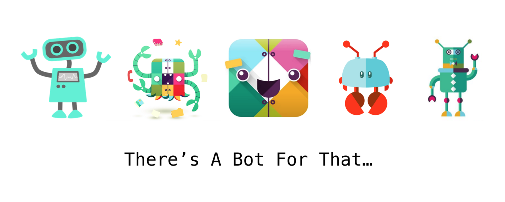

  

# Envirobot

Let me introduce you our Slack Bot for Environments Queue.

Have you ever being using a environment for QA and suddenly stop working? Maybe someone deploy new changes into your environment and that causes that errors.

Maybe you want to start your QA in one testing environment and you don't know if you can use one of your team.

No worries, here you can use the Environments Queue and be sure that your QA will be successful.

## How it works?

#### Mark a service in an environment

Click the green button of the service and environment you want to join. If it's empty, it's yours. If not, you'll be added to the queue.

#### Leave a service in an environment or leave the queue

Click the red button of the service and environment you were using.

#### Previous message deleted

Every time a button is selected, the previous message is deleted and a new updated one is sent

#### Timeout

The timeout is configured for 2 hours, if a user has the environment for more than 2 hours, a slack message will be sent asking if that user is still using the environment.

## How it's made?

- It's build with [Bolt for Javascript](https://github.com/slackapi/bolt-js#bolt--for-javascript)
- Deployments are defined in *hidden cabify page*
- Secrets are stored in *hidden cabify page*

### SlackHook Url

Event subscription and Interactivity to: *hidden cabify page*

## Improvements

- If you know how to improve something, leave a MR in our proyect

### Improves detected

- Restart the bot every day at a certain hour
- Improve default values to not be a hardoded names
- Create a form to enable the bot in every slack channel

*NOTE: This project is maintained by me and is currently being used within Cabify teams.*